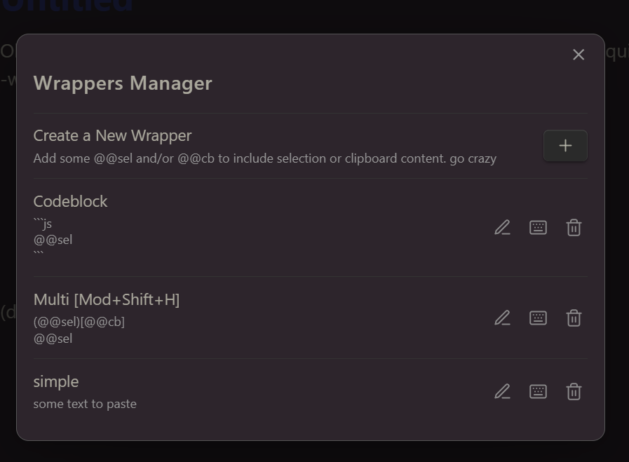
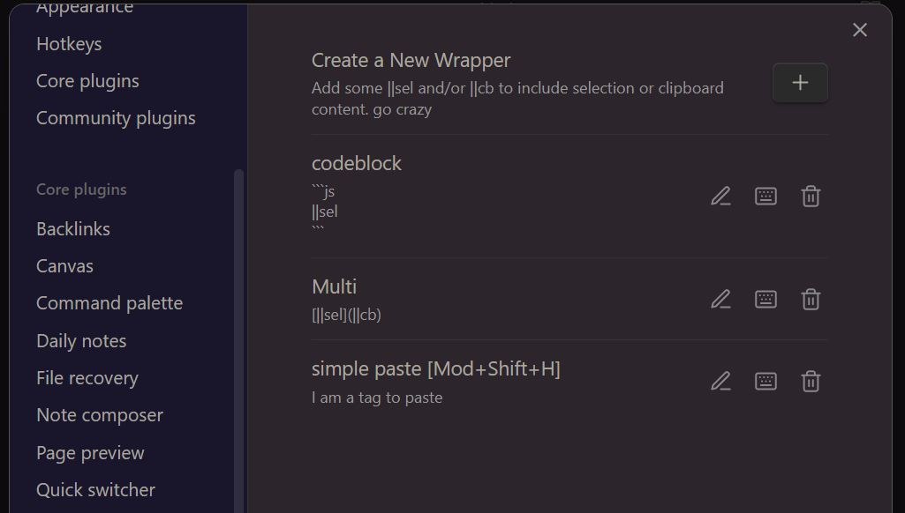

# Obsidian Quick wrappers

this plugin is highly inspired by "wrap with shortcuts". However, the author was not responsive to pull requests.

Create some wrappers to surround your selection or even clipboard content using some markers @@sel or @@cb.   
You can add several markers and mix them, on several lines.   
You can then reverse the operation.  
ADD A DEMO

Quickly create advanced wrappers from **Wrapper Manager** 

or from **Settings**


Add shortcut to each wrapper or call them from the **Wrapper Selector** you can spare a lot of shortcuts...


e.g:
```
[@@sel](@@cb)
@@cb
```


## developpement

do "npm start" at first, or a npm i

-   `npm run start` = npm install + npm run dev
-   `npm run bacp` = npm run build + git add + commit (prompt to enter message) + push
-   `npm run acp` = git add + commit (prompt to enter message) + push
-   `npm run version` = prompt to ask what version (patch(1), minor(2), major(3) or manual entering e.g 1.2.0 ). do it after your acp.
-   `npm run release`= publish a release on github with the actual version and prompt for the release message
-   `npm run test` = npm run build + export main.js manifest & styles.css(optional) to a target vault, so it can run as an installed plugin and test it.
    Prompts are guiding you.  
    if you overwrite an existing plugin folder in the target vault it will overwrite only this 3 files.

-   Use Console instead of console. by default all Console.log/debug are switched OFF on production (npm run build), and ON on developpement (npm run dev), and Console.log or debug are forced to debug. OFF on mobiles
